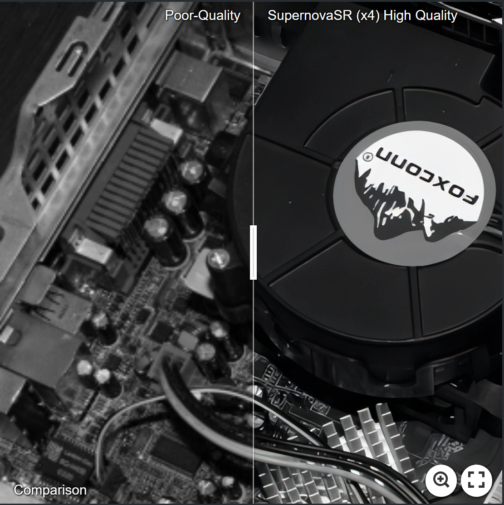

# Supernova SR: Practical Degradation Model for Deep Blind Image Super-Resolution

I bring to you SupernovaSR, a flagship-grade project conceived during my tenure as a Machine Learning Engineer at Wipro. This project was born out of a pressing challenge within the realm of Single Image Super-Resolution (SISR). Existing methods often grapple with inadequate performance when their assumed degradation models fail to account for the intricate complexities of real-world images.

SupernovaSR addresses this challenge through the introduction of a pioneering approach—a comprehensive yet practical degradation model. This model encompasses a blend of randomly applied blur, downsampling, and noise degradations. Specifically, the blur is approximated through two convolutional layers employing isotropic and anisotropic Gaussian kernels. The downsampling is randomly chosen from nearest, bilinear, and bicubic interpolations. The noise component is synthesized using multiple techniques, including the addition of Gaussian noise with varying noise levels, the application of JPEG compression at various quality factors, and the generation of processed camera sensor noise through reverse-forward camera image signal processing (ISP) pipeline modeling and RAW image noise modeling.

The primary objective of this project was to validate the effectiveness of this new degradation model. To achieve this, I meticulously trained a deep blind Enhanced Super-Resolution Generative Adversarial Network (ESRGAN) super-resolver. This model was then applied to super-resolve both synthetic and real images characterized by diverse degradation patterns.

The experimental results unequivocally demonstrate that this novel degradation model significantly enhances the practicality of deep super-resolution methods. As a result, SupernovaSR emerges as a robust and powerful alternative for real-world Single Image Super-Resolution applications. By adeptly addressing the complexity of real image degradations, this project has the potential to redefine the landscape of image enhancement and restoration.

Feel free to explore the codebase, experiment with the model, and contribute to the advancement of Single Image Super-Resolution with SupernovaSR.

Training
----------
1. Train SupernovaSRNet
    1. Modify [train_SupernovaSR_x4_psnr.json](https://github.com/Malav5372/SupernovaSR/blob/5b994b38f076a63caa72fbeab6f7648619675e88/train_SupernovaSR_x4_psnr.json) e.g., `"gpu_ids": [0]`, `"dataloader_batch_size": 4`
    2. Training with `DataParallel`
    ```bash
    python main_train_psnr.py --opt options/train_SupernovaSR_x4_psnr.json
    ```
    2. Training with `DistributedDataParallel` - 4 GPUs
    ```bash
    python -m torch.distributed.launch --nproc_per_node=4 --master_port=1234 main_train_psnr.py --opt options/train_SupernovaSR_x4_psnr.json  --dist True
    ```
2. Train SupernovaSR
    1. Put SupernovaSRNet model (e.g., '400000_G.pth') into `superresolution/SupernovaSR_x4_gan/models`
    2. Modify [train_SupernovaSR_x4_gan.json](https://github.com/Malav5372/SupernovaSR/blob/0eeebfa36f83119be26c545143aa1ad74f30e536/train_SupernovaSR_x4_gan.json) e.g., `"gpu_ids": [0]`, `"dataloader_batch_size": 4`
    3. Training with `DataParallel`
    ```bash
    python main_train_gan.py --opt options/train_SupernovaSR_x4_gan.json
    ```
    3. Training with `DistributedDataParallel` - 4 GPUs
    ```bash
    python -m torch.distributed.launch --nproc_per_node=4 --master_port=1234 main_train_gan.py --opt options/train_SupernovaSR_x4_gan.json  --dist True
    ```
3. Test SupernovaSR model `'xxxxxx_E.pth'` by modified `main_test_SupernovaSR.py`
    1. `'xxxxxx_E.pth'` is more stable than `'xxxxxx_G.pth'`


_______
✨ _**Some visual examples**_: [oldphoto2](https://imgsli.com/MjA5MjY5); [building](https://imgsli.com/MjA5Mjcz); [tiger](https://imgsli.com/MjA5Mjc4); [pattern](https://imgsli.com/MjA5Mjc2); [oldphoto6](https://imgsli.com/MjA5Mzkz); [comic_01](https://imgsli.com/MjA5Mzk5); [comic_03](https://imgsli.com/MjA5NDAx); [comic_04](https://imgsli.com/MjA5NDAz)

[](https://imgsli.com/NDgzMjU) [](https://imgsli.com/MjA5Mjc4) 
[](https://imgsli.com/MjA5NDIw) [](https://imgsli.com/MjA5NDM4)
[](https://imgsli.com/MjA5NDQ1)
[](https://imgsli.com/MjA5NDU0)
___________

* [Testing code](#testing-code)
* [Main idea](#main-idea)
* [Comparison](#comparison)
* [More visual results on RealSRSet dataset](#more-visual-results-on-realsrset-dataset)
* [Visual results on DPED dataset](#visual-results-on-dped-dataset)


Testing code
----------

* [main_test_SupernovaSR.py](main_test_SupernovaSR.py)
* [model_zoo](model_zoo) (_Download the models from [Google drive](https://drive.google.com/drive/folders/1VIyKgsCtmEmf6_HI70le6G1gHRh5yKYo?usp=drive_link)
   * Proposed:
     * SupernovaSR.pth     [[Google drive]](https://drive.google.com/drive/folders/1VIyKgsCtmEmf6_HI70le6G1gHRh5yKYo?usp=drive_link)
     * SupernovaSRNet.pth      [[Google drive]](https://drive.google.com/drive/folders/1VIyKgsCtmEmf6_HI70le6G1gHRh5yKYo?usp=drive_link)

Main idea
----------

 

__Design a new degradation model to synthesize LR images for training:__

* **_1) Make the blur, downsampling and noise more practical_**
  * **_Blur:_** _two convolutions with isotropic and anisotropic Gaussian kernels from both the HR space and LR space_
  * **_Downsampling:_** _nearest, bilinear, bicubic, down-up-sampling_
  * **_Noise:_** _Gaussian noise, JPEG compression noise, processed camera sensor noise_
* **_2) Degradation shuffle:_** _instead of using the commonly-used blur/downsampling/noise-addition pipeline, we perform randomly shuffled degradations to synthesize LR images_

__Some notes on the proposed degradation model:__

* *The degradation model is mainly designed to synthesize degraded LR images. Its most direct application is to train a deep blind super-resolver with paired LR/HR images. In particular, the degradation model can be performed on a large dataset of HR images to produce unlimited perfectly aligned training images, which typically do not suffer from the limited data issue of laboriously collected paired data and the misalignment issue of unpaired training data.*
 
* *The degradation model tends to be unsuited to model a degraded LR image as it involves too many degradation parameters and also adopts a random shuffle strategy.*

* *The degradation model can produce some degradation cases that rarely happen in real-world scenarios, while this can still be expected to improve the generalization ability of the trained deep blind super-resolver.*

* *A DNN with large capacity has the ability to handle different degradations via a single model. This has been validated multiple times. For example, DnCNN is able
to handle SISR with different scale factors, JPEG compression deblocking with different quality factors and denoising for a wide range of noise levels, while still having a performance comparable to VDSR for SISR. It is worth noting that even when the super-resolver reduces the performance for unrealistic bicubic downsampling, it is still a preferred choice for real SISR.*

* *One can conveniently modify the degradation model by changing the degradation parameter settings and adding more reasonable degradation
types to improve the practicability for a certain application.*


Comparison
----------


 

*These no-reference IQA metrics, i.e., NIQE, NRQM and PI, do not always match perceptual visual quality [1] and the IQA metric should be updated with new SISR methods [2]. We further argue that the IQA metric for SISR should also be updated with new image degradation types, which we leave for future work.*

```
[1] "NTIRE 2020 challenge on real-world image super-resolution: Methods and results." CVPRW, 2020.
[2] "PIPAL: a large-scale image quality assessment dataset for perceptual image restoration." ECCV, 2020.
```


More visual results on [RealSRSet](testsets/RealSRSet) dataset
----------


**Left**: [real images](https://github.com/Malav5372/SupernovaSRNet/tree/main/testsets/RealSRSet) **|** **Right**: [super-resolved images with scale factor 4](https://github.com/Malav5372/SupernovaSRNet/tree/main/testsets/SupernovaSR)

 

 

 

 

 

 

 

 

 

 

 

 


Visual results on DPED dataset
----------

 

 

 

*Without using any prior information of DPED dataset for training, our SupernovaSR still performs well.*

